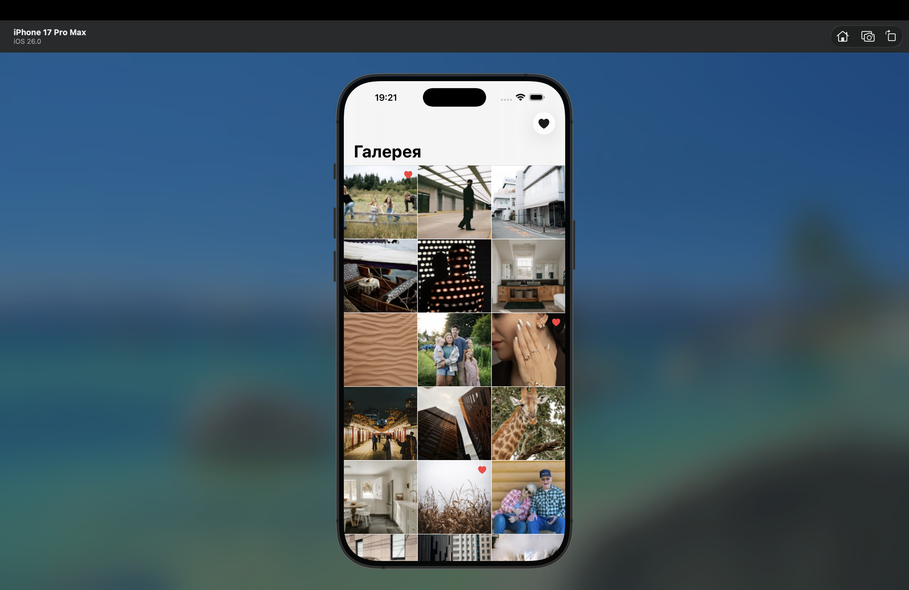
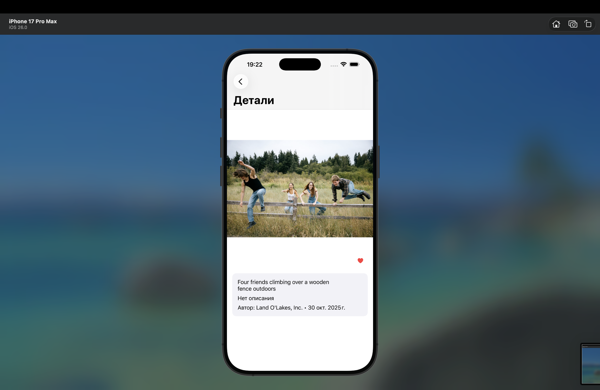
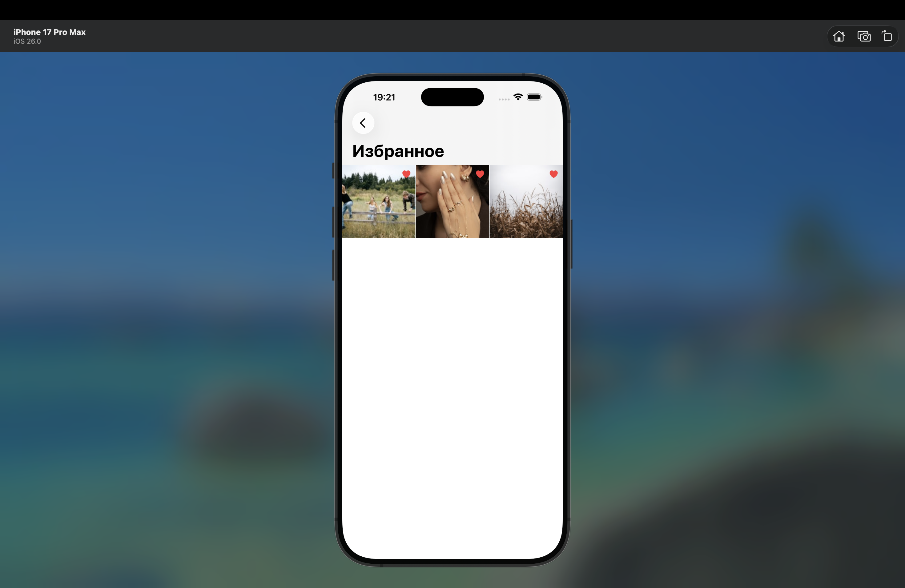

# Gallery App (Intern test task)

## Контактная информация: 
http://linkedin.com/in/angelina-golubovskaya-68b57131b
https://github.com/gang1908
+375297345858

#О проекте

Это тестовое iOS-приложение для просмотра фотографий с Unsplash.

Приложение состоит из трёх экранов:
 - галерея с сеткой изображений
 - экран с деталями выбранной фотографии
 - отдельный экран с избранными изображениями

Пользователь может просматривать ленту с автоматической подгрузкой новых фото, открывать изображения в деталях, свайпать между ними и добавлять понравившиеся в избранное.
Дополнительно я реализовала отдельный экран избранных фотографий, чтобы пользователь мог быстро вернуться к сохранённым изображениям. 
Избранные элементы сохраняются локально и остаются доступными после перезапуска приложения.
Проект написан на Swift + UIKit.

##Основной функционал:

1. Загрузка фотографий через Unsplash API (List Photos)
2. Пагинация (30 изображений на страницу)
3. Сетка на основе UICollectionView
4. Экран деталей с:
 - изображением
 - именем автора
 - описанием (если есть)
 - датой создания
 - Переключение между фото свайпами
 - Добавление и удаление из избранного
5. Отдельный экран со списком избранных изображений
6. Локальное хранение избранного (UserDefaults)
7. Простое кэширование изображений в памяти

##Архитектура:

В проекте использован упрощённый MVVM-подход.
- ViewController отвечает за UI и обработку пользовательских действий
- ViewModel содержит логику загрузки данных и пагинации
- APIService выполняет сетевые запросы
- FavoritesManager управляет состоянием избранного
- ImageCacheService кэширует изображения

Я старалась разделить ответственность между слоями и сделать структуру проекта понятной и логичной.

##Технологии:

- UIKit
- URLSession
- MVVM
- UserDefaults

##Как запустить:

Зарегистрироваться на https://unsplash.com/developers
Создать приложение и получить Access Key
Вставить ключ в Info.plist в поле:
UNSPLASH_ACCESS_KEY
Запустить проект

Минимальная версия iOS — 15.0

##Возможные улучшения:

Если продолжать развитие проекта, можно добавить:
- улучшение UX пустого экрана избранного
- более плавные анимации при переходе между экранами
- unit-тесты
- более гибкую архитектуру при масштабировании
- поддержку оффлайн-режима

# Screenshots

### Gallery

### Photo Details

### Favorites 

